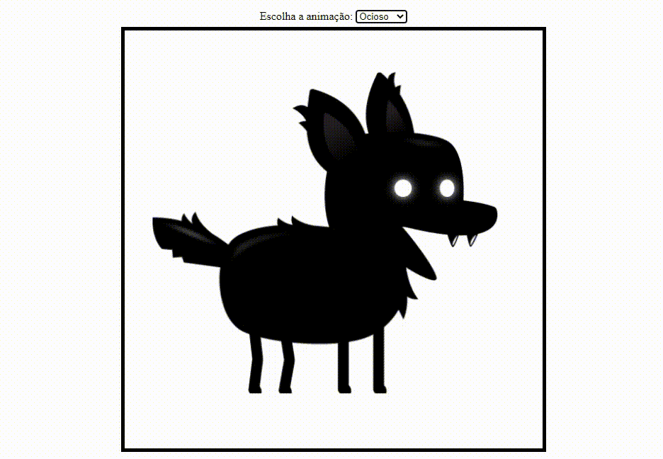

# Franks Laboratory 🧪

Repositório com projetos de **Criação de Jogos em JavaScript** propostos no canal Franks Laboratory.

### 🎯 Menu

Clique para expandir

◽ <a href="#inicio">Início</a>  
◽ <a href="#pre-requisitos">Pré-requisitos</a>  
◽ <a href="#acessar-projeto">Acessar Projeto</a>  
◽ <a href="#tecnologias">Tecnologias</a>  
◽ <a href="#sobre">Sobre</a>  
◽ <a href="#extras">Extras</a>  
◽ <a href="#preview">Preview</a>  
◽ <a href="#status">Status do Projeto</a>  
◽ <a href="#autor">Autor</a>  

<h3 id="inicio">🚀 Início</h3>

[Playlist do Curso](https://www.youtube.com/playlist?list=PLYElE_rzEw_uryBrrzu2E626MY4zoXvx2)🔗

<h3 id="pre-requisitos">📋 Pré-requisitos</h3>

<h3 id="acessar-projeto">📁 Acessar Projeto</h3>

◽ <a href="https://github.com/brseghese/pp-franks-laboratory/tree/main">Acessar</a>🔗 o código fonte pelo GitHub.  
◽ <a href="https://github.com/brseghese/pp-franks-laboratory/archive/refs/heads/main.zip">Download</a>🔗 do código fonte no formato zip. 
◽ Clonar o repositório ultilizando Git Bash + o comando:

       $ git clone https://github.com/brseghese/pp-franks-laboratory.git

<h3 id="tecnologias">⚙️ Tecnologias Utilizadas</h3>

  
  
  

<h3 id="sobre">📍 Sobre</h3>

✅ 01 - Animação de sprites.  
✅ 02 - Parallax.  

<h3 id="extras">📢 Extras</h3>

✅ CSS Flexbox.  
✅ HTML select e option.  
✅ HTML input type="range".  

<h3 id="preview">🎥 Preview</h3>

<h3 id="status">📌 Status do projeto</h3>

Cursando. 👀

<h3 id="autor">✒️ Autor</h3>

[Clique aqui](https://brseghese.github.io)🔗 e acesse meu portfólio! 💼 (em construção...)  
Desenvolvido com ❤️ por **Bruno Seghese** © Alguns direitos reservados.

  
